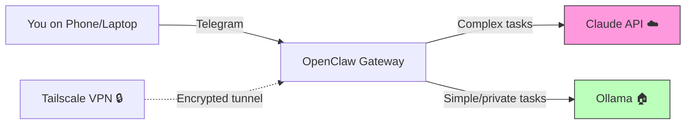

# OpenClaw AI Hub

> Your personal AI assistant — self-hosted, secure, extensible.

**OpenClaw AI Hub** is a battle-tested setup guide and toolkit for running [OpenClaw](https://openclaw.ai) as a dedicated AI assistant on your own hardware. Combine local open-source models (Mistral, Qwen, Phi-4) with cloud AI (Claude) — controlled via Telegram, accessible from anywhere.

This guide is based on months of real-world production use on a dedicated Mac Mini.

## How It Works

This is a **hybrid setup**: your AI assistant runs on a dedicated Mac on your network, reachable via Telegram from anywhere through an encrypted Tailscale tunnel.



**Important — be honest about the data flow:**
- **Claude (cloud):** Your primary model for complex tasks. Requests are sent to Anthropic's API — data leaves your machine. Anthropic's [API data policy](https://www.anthropic.com/policies/privacy) states that API data is not used for training, and a DPA is available.
- **Ollama (local):** Models like Mistral 7B and Qwen 2.5 run 100% on your hardware. Data never leaves your machine. But these models are significantly less capable than Claude for complex reasoning, orchestration, and multi-step tasks.
- **Tailscale:** End-to-end encrypted mesh VPN. No traffic goes through Tailscale's servers.

> **Want automatic routing of sensitive data to local models?** Check out [OpenClaw AI Hub Pro](#-openclaw-ai-hub-pro) with the **Privacy Router**.

## Features

- **Dedicated AI machine** — runs 24/7 on a Mac Mini (or similar hardware)
- **Telegram interface** — chat with your AI from anywhere
- **Local + Cloud models** — Ollama for privacy-sensitive tasks, Claude for heavy lifting
- **Tailscale VPN** — secure remote access without port forwarding
- **LaunchAgents** — reliable macOS-native task scheduling (not cron, not OpenClaw crons — [here's why](launchagents/README.md))
- **Security hardening** — guest WiFi isolation, firewall, FileVault, standard user account
- **Cost optimization** — model routing, heartbeat tuning, session hygiene
- **SOUL.md template** — personality, boundaries, and prompt injection defense

## Supported Models

| Model | Type | RAM | Strength | Use Case |
|-------|------|-----|----------|----------|
| Mistral Small 3.1 22B (Q4_K_M) | Local | ~16 GB | General purpose, tool use | Primary fallback, sub-agents |
| Qwen 2.5 3B | Local | ~2 GB | Lightweight routing | Cron jobs, heartbeat |
| Qwen 2.5 Coder 14B | Local | ~9 GB | Code generation | Dedicated coding sub-agent |
| Phi-4 14B | Local | ~9 GB | Reasoning | Analysis (no tool support!) |
| Claude Sonnet | Cloud | — | Orchestration, complex tasks | Primary conversation model |

> **RAM guide:** 16 GB minimum for one local model alongside OpenClaw. 24 GB recommended. 64 GB lets you run multiple large models simultaneously.

## Quick Start

### Prerequisites
- Mac Mini M1/M2/M4 (or comparable hardware with 16+ GB RAM)
- macOS 14+
- A Telegram account
- An Anthropic API key ([console.anthropic.com](https://console.anthropic.com))

### Installation

```bash
git clone https://github.com/kirchbergcapitalservices/openclaw-ai-hub.git
cd openclaw-ai-hub
chmod +x scripts/*.sh
./scripts/install.sh
```

The install script will:
1. Check prerequisites (Homebrew, Node.js)
2. Install Ollama and pull recommended models
3. Install OpenClaw
4. Guide you through the onboarding wizard

For the full step-by-step guide, see **[docs/SETUP.md](docs/SETUP.md)**.

## Documentation

| Doc | Description |
|-----|-------------|
| [SETUP.md](docs/SETUP.md) | Complete step-by-step installation guide |
| [SECURITY.md](docs/SECURITY.md) | macOS hardening, network isolation, account separation |
| [ARCHITECTURE.md](docs/ARCHITECTURE.md) | System architecture and data flow |
| [COST-OPTIMIZATION.md](docs/COST-OPTIMIZATION.md) | Model routing, heartbeat config, session hygiene |
| [TROUBLESHOOTING.md](docs/TROUBLESHOOTING.md) | Common problems and solutions |
| [MEMORY-MANAGEMENT.md](docs/MEMORY-MANAGEMENT.md) | Memory architecture, staleness prevention, multi-node sync |

## Data Privacy

This setup is a **hybrid model** — be clear-eyed about what goes where:

| Data Path | What Happens | Your Control |
|-----------|-------------|--------------|
| **Local (Ollama)** | Data stays on your machine. Zero network traffic. | Full control |
| **Cloud (Claude API)** | Data sent to Anthropic via TLS 1.3. Not used for training. DPA available. | API terms apply |
| **Tailscale** | End-to-end encrypted. No data on Tailscale servers. | Full control |
| **Telegram** | Messages routed through Telegram servers. | Telegram terms apply |

**For full data sovereignty over sensitive content**, you need to route queries intelligently — keeping financial data, personal information, and confidential documents on local models while letting general knowledge queries go to the cloud. This is exactly what the Pro version's Privacy Router does automatically.

## OpenClaw AI Hub Pro

The Pro version adds:

- **Privacy Router** — Automatic routing based on data sensitivity. Financial data, personal information, and NDA content stay local. General queries go to the cloud. Configurable rules with PII detection and anonymization.
- **GDPR/DSGVO Compliance Kit** — Processing directory templates, data protection impact assessment, DPA templates — ready to fill in for your organization.
- **Multi-Node Setup** — Run multiple Mac Minis with task coordination, capacity planning, and automatic failover.
- **Prompt Injection Defense** — Battle-tested detection patterns, counter-escalation protocols, and automated monitoring. Based on real-world attacks.
- **Advanced Model Routing** — Detailed guide on which model for which task, pitfalls (e.g., models without tool support), cost optimization strategies.
- **Lessons Learned** — 7 critical mistakes from production use and how to avoid them.
- **Apple Integration** — Calendar, Reminders, Notes via CLI tools.
- **Monitoring Dashboard** — Request stats, cost tracking, privacy audit log.

**Access via GitHub Sponsors** — [Become a sponsor](https://github.com/sponsors/kirchbergcapitalservices) starting at €19/month.

## Contributing

Issues and pull requests are welcome! See [CONTRIBUTING.md](CONTRIBUTING.md).

## License

MIT License — see [LICENSE](LICENSE).

---

*For enterprise AI infrastructure solutions, [get in touch](https://github.com/kirchbergcapitalservices).*
