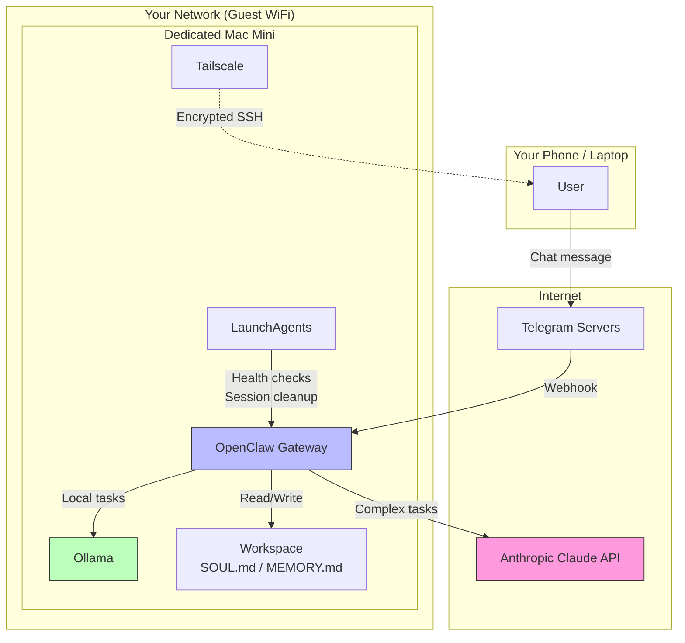
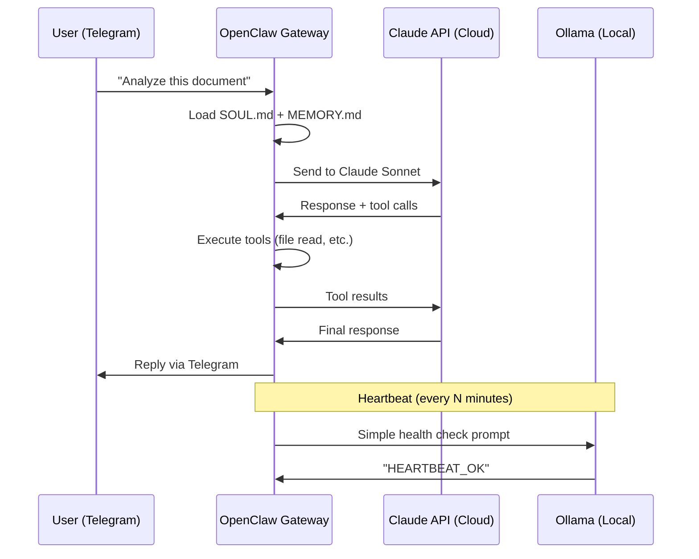

# Architecture

## System Overview



## Components

### OpenClaw Gateway

The core process. It:
- Receives messages from Telegram
- Manages conversation sessions
- Routes requests to Claude (cloud) or Ollama (local)
- Executes tools (file read/write, shell commands, web search)
- Manages memory (MEMORY.md, workspace files)
- Runs heartbeat checks at configurable intervals

**Installed via:** `npm install -g openclaw`
**Runs as:** macOS LaunchAgent (auto-starts on boot)

### Ollama

Local LLM runtime. Runs models directly on the Mac's GPU/CPU with zero network traffic.

**Key models:**
- **mistral-small:22b** — Heartbeat (fixed model; already warm in RAM, use `lightContext: true` in config)
- **qwen2.5:3b** — Lightweight fallback tasks (NOT for heartbeat — caused repeated timeout hangs)
- **mistral:7b** / **qwen2.5:7b** — General purpose sub-agent tasks
- **qwen2.5-coder:14b** — Dedicated coding tasks
- **nomic-embed-text** — Embeddings for memory vector search

**Important:** Some local models (like phi-4, llama3.2-vision) lack tool support. They cannot be used as sub-agents with `sessions_spawn` — only via direct `exec` calls.

### Tailscale

Mesh VPN for secure remote access:
- End-to-end encrypted tunnel between your devices
- No port forwarding needed
- Tailscale SSH replaces macOS Remote Login
- Works across networks (home, office, mobile)

### LaunchAgents

macOS-native task scheduling. **Do NOT use OpenClaw's built-in cron system for system tasks.**

Why? OpenClaw crons that invoke local LLMs can hang on timeout, creating dead sessions. The next cron tick creates another dead session. Within hours, the system becomes unresponsive.

LaunchAgents are OS-level, use simple shell scripts, and don't depend on the LLM being available.

See [launchagents/README.md](../launchagents/README.md) for details.

### Workspace

OpenClaw's persistent storage:

```
~/.openclaw/
├── openclaw.json          # Main configuration
├── .env                   # API keys (never commit!)
├── workspace/
│   ├── SOUL.md            # Agent personality and boundaries
│   ├── MEMORY.md          # Persistent context (<16K chars)
│   ├── HEARTBEAT.md       # Heartbeat check rules
│   ├── memory/            # Detailed memory files
│   │   └── archive/       # Older memory entries
│   └── scripts/           # Agent-accessible scripts
├── agents/
│   └── main/
│       └── sessions/      # Conversation session files
└── logs/
    ├── gateway.out.log
    └── gateway.err.log
```

## Data Flow

### Message Lifecycle



### Model Routing

```
User message
    │
    ├─ Primary conversation ──────── Claude Sonnet (cloud)
    │
    ├─ Sub-agent: code ──────────── Ollama / qwen2.5-coder (local)
    │
    ├─ Sub-agent: draft/summary ─── Ollama / mistral (local)
    │
    ├─ Heartbeat checks ─────────── Ollama / mistral-small:22b (local, lightContext=true)
    │
    └─ Image analysis ───────────── Ollama / llama3.2-vision (local, exec only)
```

## Network Architecture

```mermaid
graph LR
    subgraph "Main Home Network"
        PC[Your Laptop]
        NAS[NAS]
        IOT[Smart Home]
    end

    subgraph "Guest Network (Isolated)"
        MAC[AI Mac Mini]
    end

    subgraph "Internet"
        ANTH[Anthropic API]
        TELE[Telegram]
    end

    subgraph "Tailscale Mesh (Overlay)"
        PC -.->|Encrypted| MAC
    end

    MAC -->|HTTPS| ANTH
    MAC -->|HTTPS| TELE
    MAC -.x|Blocked| NAS
    MAC -.x|Blocked| IOT

    style MAC fill:#bbf,stroke:#333
```

The guest network ensures the AI machine cannot reach your other devices, even if compromised. Tailscale provides a secure overlay network for your SSH access.

## Extension Points

OpenClaw supports various integrations:
- **MCP servers** — Connect to external services (Dropbox, Google Sheets, etc.)
- **Skills** — Community plugins from ClawHub (always review before installing!)
- **Custom scripts** — Shell scripts the agent can execute
- **Browser automation** — Web scraping and form filling (use with caution)

For advanced features like automatic privacy-based routing, multi-node setups, and GDPR compliance, see **OpenClaw AI Hub Pro**.
